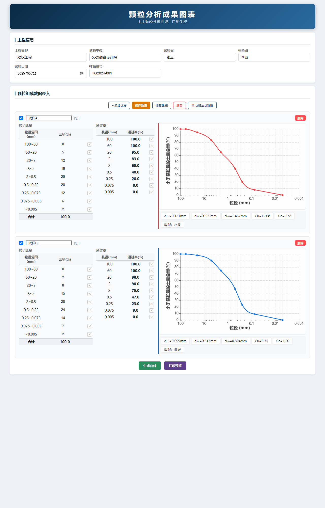
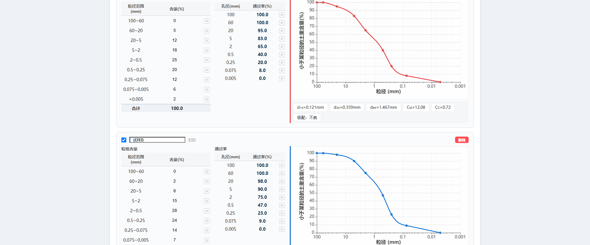
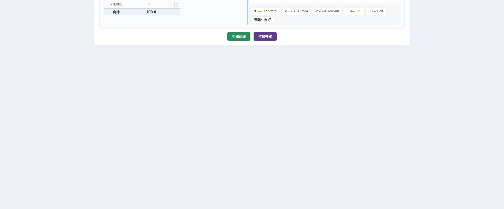

# 颗粒分析成果图表

土工试验颗粒分析数据录入、曲线生成与打印输出工具。

## 功能特性

- **工程信息**：记录工程名称、试验单位、试验人员、日期等基本信息
- **粒组含量录入**：支持 9 个粒径段（100~60 至 <0.005）的数据输入
- **通过率自动计算**：根据粒组含量自动计算各孔径通过率
- **级配曲线**：基于 ECharts 绘制对数坐标颗粒级配曲线，支持三次样条插值平滑显示
- **级配指标**：自动计算 d₁₀、d₃₀、d₆₀、Cu、Cc 及级配评价
- **数据管理**：
  - 添加/删除试样
  - 行级删除（粒组/通过率）
  - 键盘上下键快速切换输入框
  - 从 Excel 直接粘贴数据
- **数据持久化**：保存到本地 JSON 文件（含工程信息）及浏览器 localStorage
- **打印预览**：A4 纵向排版，每页三组数据，自动生成图表图片嵌入打印页

## 技术栈

- 纯前端，无需服务器
- [ECharts 5.4.3](https://echarts.apache.org/) — 图表渲染
- 原生 JavaScript + CSS，零依赖

## 界面预览

| 界面 | 说明 |
|------|------|
|  | 整体界面：工程信息、数据录入、级配曲线 |
|  | 颗粒级配曲线图表区域 |
|  | 粒组含量与通过率数据表格 |

## 使用说明

1. 在浏览器中打开 `index.html` 或 `颗粒分析成果图表.html`（推荐 Chrome / Edge）
2. 填写工程信息（可选）
3. 点击 **"+ 添加试样"** 添加试样
4. 在"粒组含量"表格中输入各粒径段百分比含量
5. 点击 **"生成曲线"** 绘制级配曲线
6. 点击 **"打印预览"** 查看排版效果并打印

### 数据导入

在 Excel 中按以下列顺序选中数据，复制后点击 **"从 Excel 粘贴"**：

```
试样名称  100~60  60~20  20~5  5~2  2~0.5  0.5~0.25  0.25~0.075  0.075~0.005  <0.005
```

### 数据保存

点击 **"保存数据"** 将自动下载 `颗粒分析成果数据.json` 文件，同时存入浏览器本地存储。

## 版本说明

本系统提供三种使用方式：

| 文件 | 类型 | 说明 |
|------|------|------|
| `index.html` | 开发版 | 主页面，引用独立的 `css/style.css` 和 `js/app.js`，便于开发和调试 |
| `颗粒分析成果图表.html` | 在线单文件版 | 单文件整合版，ECharts 通过 CDN 加载，需联网使用 |
| `颗粒分析成果图表_离线版.html` | 离线单文件版 | 单文件整合版，ECharts 内嵌于文件中，无需网络即可使用 |
| `颗粒分析成果图表.exe` | Windows 可执行程序 | 使用 NW.js 或类似工具打包，双击即可运行，无需浏览器 |

## 目录结构

```
颗粒分析成果图表系统/
├── index.html                     # 主页面（开发版）
├── 颗粒分析成果图表.html          # 在线单文件版
├── 颗粒分析成果图表_离线版.html   # 离线单文件版
├── 颗粒分析成果图表.exe           # Windows 可执行程序
├── css/
│   └── style.css                  # 样式文件
├── js/
│   └── app.js                     # 逻辑代码
├── screenshots/                   # 界面截图
│   ├── 01_overview.png            # 整体界面概览
│   ├── 02_chart.png               # 级配曲线图
│   └── 03_data_table.png          # 数据表格
├── README.md                      # 本文件
└── .gitignore                     # Git 忽略配置
```

## 浏览器兼容性

支持所有现代浏览器（Chrome、Edge、Firefox、Safari）。
